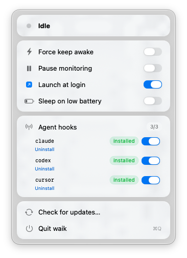

<div align="center">

# waik

**Keep your Mac awake while your coding agent is working — and only then.**

[](https://www.apple.com/macos/)
[](https://swift.org)
[](https://swift.org/package-manager/)
[](#license)

</div>

<p align="center">
  
</p>

`waik` is a tiny native menu bar app for macOS that watches the processes you actually care about — Claude Code, Codex, Cursor, Zed, ChatGPT — and holds a system sleep assertion **only while one of them is streaming traffic to a known AI host**. The moment the work stops, the assertion is released and your Mac is allowed to sleep again.

No timers to set. No "stay awake forever" pill to remember to swallow. Your laptop sleeps when *you* aren't working, and stays awake when your agent is.

---

## Why

Long-running AI agent tasks are exactly the workload macOS gets wrong:

- `caffeinate` and similar tools are blunt — they keep the machine awake until you remember to kill them.
- macOS's own power management has no concept of "this process is doing real work I'm waiting on" when the work happens in someone else's HTTPS stream.
- Closing the lid or letting the display sleep can suspend the network stack mid-stream, killing a 20-minute task at minute 19.

`waik` solves this by treating *the streaming connection itself* as the signal.

## Features

- **Zero configuration.** Defaults cover the most common coding agents and AI providers.
- **Smart detection.** Triggers only when a watched process **and** a known AI host are on the same connection — no false positives from Electron telemetry or Google Drive sharing Fastly IPs with `generativelanguage.googleapis.com`.
- **Live, slick popover.** Translucent menu bar UI with a live countdown, animated receiving indicator, and one-click overrides.
- **System-wide sleep control.** Optional helper daemon (registered via `SMAppService`) prevents *system* sleep too — not just display sleep — so lid-closed sessions on external power keep running.
- **Cheap and quiet.** 1 Hz polling of socket tables plus per-process CPU deltas to detect streaming work. No packet inspection, no kernel extension, no admin password, no network proxy.
- **Native SwiftUI.** Single binary, no Electron, no Python runtime.

## Install

### Homebrew (recommended)

```bash
brew tap joshuajomiller/waik
brew install --cask waik
```

(Once the helper daemon is approved on first launch, in-app updates handle the rest.)

### From source

```bash
git clone https://github.com/joshuajomiller/waik.git
cd waik
Scripts/build.sh
open build/waik.app
```

The first launch will ask you to approve a background item in **System Settings → Login Items**. That's the helper daemon that handles system-wide sleep control via the IOKit power assertion APIs. Click the icon in the menu bar, follow the "Open Login Items…" prompt if shown.

### Requirements

- macOS 13 (Ventura) or later — uses `MenuBarExtra`, `SMAppService`, and modern `TimelineView` APIs.
- Apple Silicon or Intel.
- Swift 5.9+ toolchain (Xcode 15 or `xcode-select --install`).

## Usage

Once running, the icon lives in your menu bar. Click it to see:

- **Status** — `Idle`, `Keep-awake engaged`, `Forced awake`, or `Monitoring paused`, with a colored dot.
- **Live countdown** — when engaged, a ticking timer + progress bar showing how much of the grace window remains before release.
- **Receiving indicator** — a pulsing green dot whenever real bytes are moving on a watched connection.
- **Force keep awake** — override that pins the assertion on regardless of activity.
- **Pause monitoring** — temporarily disable all detection.
- **Watched processes** — current watchlist (collapsible).

That's it. Most users will install it and never open the menu again.

## How it works

```
┌─────────────────┐    1 Hz    ┌──────────────────┐
│ SocketScanner   │ ─────────▶ │ ActivityMonitor  │
│ (proc_pidinfo)  │            │   - process×IP   │
└─────────────────┘            │   - CPU delta    │
        ▲                      └─────────┬────────┘
        │                                │
┌───────┴─────────┐                      ▼
│ sysctl          │            ┌──────────────────┐
│ KERN_PROC_ALL   │            │ AppCoordinator   │
│ (full pid list) │            │   - state machine│
└─────────────────┘            └─────────┬────────┘
                                         │
                       ┌─────────────────┼──────────────────┐
                       ▼                 ▼                  ▼
              ┌──────────────┐  ┌──────────────┐  ┌──────────────────┐
              │ MenuBarView  │  │ IOKit power  │  │ XPC helper       │
              │ (SwiftUI)    │  │ assertion    │  │ (system sleep)   │
              └──────────────┘  └──────────────┘  └──────────────────┘
```

Every second, `waik`:

1. Enumerates every PID via `sysctl(KERN_PROC_ALL)` (the heavily-filtered `proc_listallpids` misses Electron apps on macOS 14+).
2. For each PID, asks the kernel for its open TCP connections via `proc_pidinfo(PROC_PIDFDSOCKETINFO)`.
3. Matches each connection against the watched-process list **and** a periodically-refreshed DNS cache of known AI hostnames.
4. If a matched connection exists, samples that process's cumulative CPU time via `proc_pidinfo(PROC_PIDTASKINFO)` and compares to the previous tick. Above the activity threshold, the keep-awake window is refreshed.
5. As long as the window is alive, an `IOPMAssertionCreateWithName(kIOPMAssertionTypeNoIdleSleep)` is held in-process *and* the helper daemon disables system sleep via `pmset`.

### Why CPU delta, not socket bytes

The obvious-looking signal — TCP send/receive buffer occupancy (`sbi_cc`) — does not work for streaming responses. Both the kernel and the userspace consume the buffer faster than any practical sampling rate; instrumented runs at 5 Hz observed `sbi_cc = 0` continuously on actively-streaming Anthropic connections. Cumulative process CPU time, by contrast, monotonically advances whenever the watched process decodes tokens, redraws its TUI, or dispatches tool calls. The default threshold is **0.5 % CPU per second** — well above the noise floor of an idle SSE keep-alive and reliably below the floor of a streaming response.

The window decays naturally (default 45s) once activity stops. If the watched process drops below the CPU threshold for the full window, the assertion is released and the machine is free to sleep.

## Configuration

`waik` is intentionally minimal. The defaults are good. If you need to tune them, the watchlists live in `Sources/WaikApp/Preferences.swift` and `Sources/WaikApp/ResolverCache.swift`:

| Default watched processes | Default AI hosts |
|---|---|
| `claude`, `codex` | `api.anthropic.com` |
| `Claude`, `ChatGPT` | `api.openai.com` |
| `Cursor`, `Cursor Helper` | `chatgpt.com` |
| `zed`, `Code Helper` | `generativelanguage.googleapis.com` |

> Process names are matched against the kernel-recorded `comm` name (truncated to 16 chars by Darwin — same as what `ps -o comm` shows). Keep custom entries ≤ 16 characters.

The grace window is fixed at 45 seconds — long enough to bridge SSE keep-alive heartbeats from the Anthropic and OpenAI APIs without releasing prematurely.

## Privacy

`waik` runs entirely on-device and never sees a single packet payload.

- It uses the same `proc_pidinfo` APIs that `lsof`, `nettop`, and `top` use to read connection 5-tuples and per-process CPU times — never packet bodies, never process memory.
- It resolves a small fixed list of AI hostnames to IPs via the system resolver every 5 minutes. No other DNS activity.
- No analytics, no telemetry, no auto-update phoning home. There is no network code in the app *at all* beyond the periodic `getaddrinfo` for the host cache.
- The helper daemon's entire XPC surface is two methods: `ping()` and `setSleepDisabled(Bool)`.

## Building

```bash
# Debug build (ad-hoc signed, fine for local use)
Scripts/build.sh

# Release build
CONFIG=release Scripts/build.sh

# Signed build for distribution (requires a Developer ID Application cert)
SIGN_ID="Developer ID Application: Your Name (TEAMID)" \
  Scripts/build.sh
```

### Release process

Tag a version and push:

```bash
git tag v0.3.0 && git push --tags
```

The `Release` workflow builds, signs, packages, and publishes a GitHub Release with the `.app.zip` + sha256 attached. Signing mode is chosen automatically from the secrets you set:

| Mode | Trigger | Result |
|---|---|---|
| **Ad-hoc** (default) | `DEVELOPER_ID_CERT_P12_BASE64` not set | Gatekeeper warns users on first launch; they right-click → Open |
| **Developer ID + notarized** | All five secrets below set | Released `.app` launches cleanly everywhere |

To switch on Developer ID signing + notarization, add these repo secrets at **Settings → Secrets and variables → Actions**:

| Secret | How to generate |
|---|---|
| `DEVELOPER_ID_CERT_P12_BASE64` | Export your *Developer ID Application* cert from Keychain Access (right-click → Export, choose `.p12`, set a password). Then `base64 < cert.p12 \| pbcopy` and paste. |
| `DEVELOPER_ID_CERT_PASSWORD` | The password you set on the `.p12`. |
| `WAIK_TEAM_ID` | Your 10-character Apple Developer Team ID (Membership page on developer.apple.com). |
| `AC_APPLE_ID` | The Apple ID associated with your developer account. |
| `AC_APP_SPECIFIC_PASSWORD` | Generate at appleid.apple.com → Sign-In and Security → App-Specific Passwords. Used by `notarytool`. |

Once all five are present, the next tagged release auto-notarizes and staples without any code changes.

### Enabling Sparkle auto-updates

`waik` ships with Sparkle 2 integration ready to go — the menu has a "Check for updates…" item and the app respects `SUEnableAutomaticChecks`. To actually serve updates you need to generate an EdDSA signing key pair and host the appcast:

1. Download Sparkle's tarball: <https://github.com/sparkle-project/Sparkle/releases>
2. Generate a keypair: `./bin/generate_keys`. The public key prints to stdout; the private key is stored in your Keychain by default. Export the private key with `./bin/generate_keys -x sparkle.key`.
3. Paste the **public** key into `Resources/Info.plist`:
   ```xml
   <key>SUPublicEDKey</key>
   <string>YOUR_PUBLIC_KEY_HERE</string>
   ```
4. Add the **private** key as a GitHub repo secret named `SPARKLE_ED_PRIVATE_KEY` (paste the file contents).
5. Enable GitHub Pages on the `gh-pages` branch (repo Settings → Pages → Source: Deploy from a branch → `gh-pages`).
6. Cut a new release. The workflow signs the .zip, appends an entry to `gh-pages/appcast.xml`, and pushes. Existing users running `waik` will see the update on the next periodic check.

Until you complete those steps, the in-app "Check for updates…" item gracefully reports "Unable to check" — fail-closed by design.

### Enabling the Homebrew cask

1. Create an empty public repo at `joshuajomiller/homebrew-waik` (Homebrew taps must use that prefix).
2. Generate a fine-grained Personal Access Token with **Contents: read & write** scope on that single repo.
3. Add it as a repo secret named `HOMEBREW_TAP_TOKEN`.
4. Cut a release. The workflow renders `Casks/waik.rb` with the new version + sha256 and pushes to `joshuajomiller/homebrew-waik`.

Users can then install with `brew tap joshuajomiller/waik && brew install --cask waik`. The cask in this repo is the source of truth — edit it here, and every subsequent release picks up the changes automatically.

The output is a self-contained `build/waik.app` bundle with the helper daemon inside `Contents/Library/LaunchDaemons`. SMAppService handles registration at first launch.

### Project layout

| Path | What's in it |
|---|---|
| `Sources/WaikApp` | The menu bar app — SwiftUI, coordinator, activity monitor, helper client. |
| `Sources/WaikHelper` | Privileged helper daemon — XPC-served wrapper around `pmset`. |
| `Sources/WaikShared` | XPC protocol + constants shared between the two. |
| `Sources/CProcInfo` | C shim for `sysctl(KERN_PROC_ALL)` + `proc_pidinfo` enumeration. |
| `Resources` | Info.plist, daemon plist, entitlements. |
| `Scripts/build.sh` | Assembles the .app bundle and signs it. |

## Troubleshooting

<details>
<summary><strong>The menu bar icon doesn't appear on my notched MacBook</strong></summary>

macOS adds third-party menu bar items leftward, so newly-launched apps land closest to the notch — and can fall behind it. ⌘-drag the icon to the right past your other status items, or install [Ice](https://github.com/jordanbaird/Ice) to pin it where you want it.
</details>

<details>
<summary><strong>"Daemon awaiting approval" warning in the menu</strong></summary>

macOS requires you to opt-in to background items. Click **Open Login Items…** in the popover, find `waik`, and toggle it on. The warning will clear within a few seconds.
</details>

<details>
<summary><strong>It never engages even though Claude is clearly working</strong></summary>

Check the watched-process list under the menu — the `comm` name may differ from the app's display name. For Electron apps especially, the actual networking process is often a helper (`Code Helper`, `Cursor Helper`). Add the correct `comm` name to `defaultWatchedProcesses` in `Preferences.swift` and rebuild.
</details>

## Contributing

PRs welcome — especially additions to the default watchlist and AI host list. Please:

1. Verify the new process name with `ps -axo comm | sort -u | grep -i <name>`.
2. Verify the host actually shows up via `nslookup <hostname>` and check it's a stable A record (not a CDN shared with unrelated services).
3. Open a PR with a short note on which agent / provider the addition covers.

## License

MIT — see [LICENSE](LICENSE).
